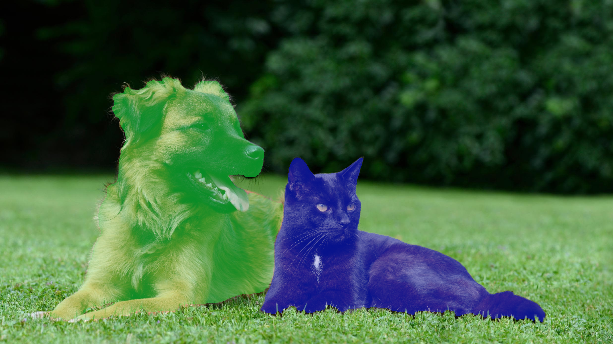
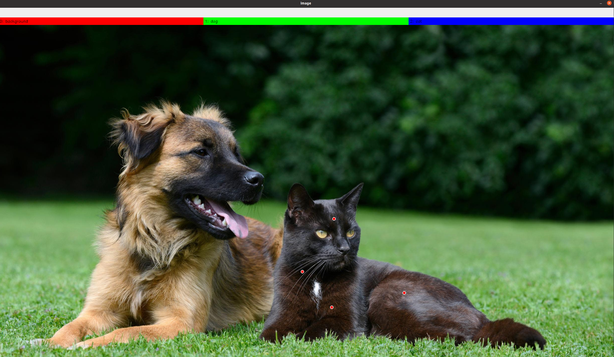
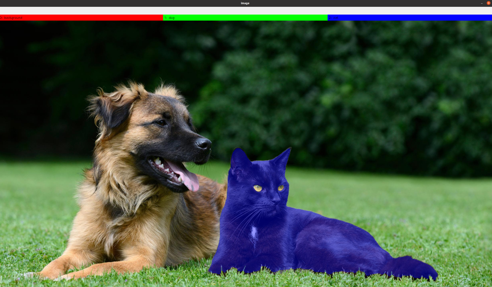
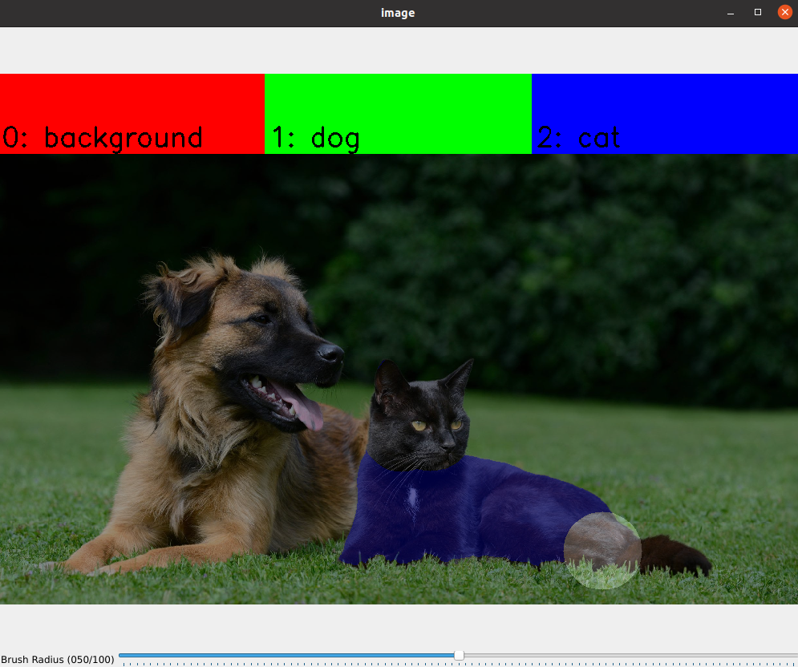
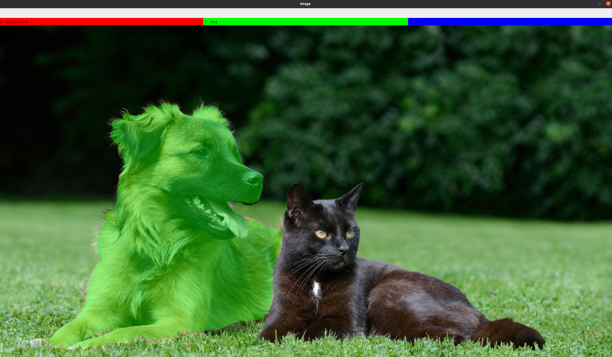
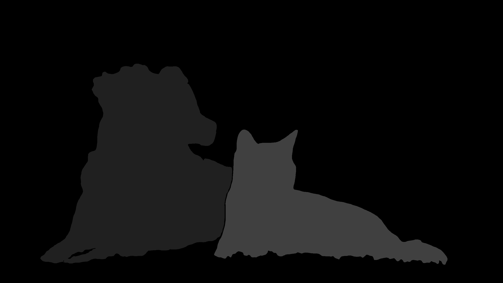

# SEMI-AUTOMATIC LABELLING TOOL FOR SEMANTIC SEGMENTATION

Esta es una herramienta para etiquetar imágenes con el soporte del Modelo Segment Anything (SAM). La herramienta ha sido desarrollada en colaboración con [leobarcellona](https://github.com/leobarcellona) y mejorada con nuevas funcionalidades automáticas.



## CARACTERÍSTICAS PRINCIPALES

- ✅ **Generación automática de máscaras**: Al hacer clic, la máscara se actualiza automáticamente sin necesidad de presionar teclas adicionales
- ✅ **Ventana maximizada**: La interfaz se abre automáticamente maximizada para mejor visualización
- ✅ **Propagación de puntos**: Los puntos se transfieren automáticamente entre imágenes consecutivas, generando nuevas máscaras adaptadas a cada imagen
- ✅ **Modo pincel**: Permite refinar manualmente las máscaras con control de tamaño de pincel
- ✅ **Interfaz intuitiva**: Colores claros para puntos (verde=positivo, rojo=negativo)

## INSTALACIÓN

```bash
git clone https://github.com/bach05/SAM_annotation_tool.git
cd SAM_annotation_tool/
pip install -r requirements.txt 
```
Descarga los pesos `sam_vit_l_0b3195.pth` del [repositorio oficial](https://github.com/facebookresearch/segment-anything) y colócalos en la carpeta 'SAM_annotation_tool/'.

Por favor, usa el archivo `config.json` para especificar tus requisitos:

```json
{
    "sam_model": {
        "name": "vit_l",
        "checkpoint_path": "./sam_vit_l_0b3195.pth"
    },
    "label_info": {
        "0": {"name": "background", "color": [0, 0, 255]},
        "1": {"name": "label1", "color": [0, 255, 0]},
        "2": {"name": "label2", "color": [255, 0, 0]},
          .
          .
          .
    },
    "raw_data_path": "folder_containing_the_images_to_label",
    "output_path": {
        "root": "destination_for_labelled_data",
        "img_subpath": "imgs",
        "label_subpath": "labels"
    },
    "max_image_dimension": 1024
```

## USO

```bash
python3 label_with_SAM.py "path_to_config_file"
```

La interfaz gráfica se abrirá automáticamente **maximizada** para una mejor experiencia. En la terminal puedes ver información sobre las acciones actuales.


## CONTROLES DEL TECLADO

| Tecla | Acción |
|-------|--------|
| `m` | Activar/desactivar modo pincel |
| `v` | Mostrar/ocultar máscara |
| `r` | Reiniciar puntos y máscara |
| `a` | Comenzar nuevo objeto |
| `q` | Guardar y pasar a la siguiente imagen |

## FLUJO DE TRABAJO

### 1. Agregar Puntos
La máscara se genera **automáticamente** al hacer clic, sin necesidad de presionar teclas adicionales:

- **Clic IZQUIERDO**: Agrega **PUNTOS POSITIVOS** (verde) 🟢 - Indican dónde está el objeto
- **Clic DERECHO**: Agrega **PUNTOS NEGATIVOS** (rojo) 🔴 - Indican dónde NO está el objeto



⚡ **Generación Automática**: Cada vez que agregas un punto, SAM genera inmediatamente la máscara actualizada.


### 2. Refinar la Máscara
Si no estás satisfecho, simplemente agrega más puntos positivos o negativos. La máscara se actualizará automáticamente con cada clic.




### 3. Modo Pincel (Opcional)
Presiona `m` para activar el **modo pincel** y hacer ajustes manuales finos:

- **Clic IZQUIERDO**: Agregar píxeles a la máscara
- **Clic DERECHO**: Remover píxeles de la máscara
- **Barra deslizante "Brush Size"**: Ajustar el tamaño del pincel



Presiona `m` nuevamente para volver al modo de puntos.

### 4. Agregar Más Objetos
Para etiquetar un nuevo objeto, presiona `a` y repite los pasos 1-3.




### 5. Guardar y Continuar
Cuando hayas etiquetado todos los objetos en la imagen, presiona `q`:

- Se guardará la máscara en la carpeta de salida especificada
- Los puntos actuales se **propagarán automáticamente** a la siguiente imagen
- SAM generará una **nueva máscara adaptada** a la siguiente imagen usando esos puntos

Si no etiquetas nada y presionas `q`, la imagen se omitirá.




### 6. Propagación Automática entre Imágenes
🚀 **Nueva funcionalidad**: Cuando pasas a la siguiente imagen:
- Los puntos de la imagen anterior se transfieren automáticamente
- SAM genera una nueva máscara específica para la nueva imagen
- Esto acelera significativamente el etiquetado de secuencias de imágenes similares

Puedes continuar refinando la máscara agregando más puntos o usar `r` para empezar desde cero.

## FINALIZAR

El script termina cuando se procesa la última imagen. Puedes salir en cualquier momento con `CTRL+C` en la terminal.

## CONSEJOS

💡 **Tip 1**: Comienza con pocos puntos positivos en el centro del objeto y agrega puntos negativos cerca de los bordes si es necesario.

💡 **Tip 2**: Usa `v` para alternar la visualización de la máscara y ver mejor los detalles de la imagen.

💡 **Tip 3**: En secuencias de imágenes similares, la propagación automática de puntos puede ahorrarte mucho tiempo.

💡 **Tip 4**: El modo pincel es ideal para correcciones pequeñas y detalles finos que SAM no captura bien. 
